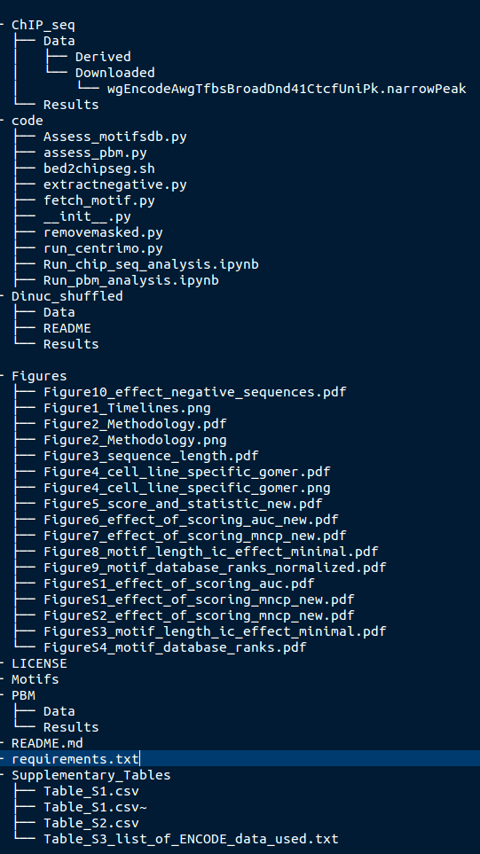

# Kibet and Machanick (2016)-F1000Research Supplementary data and code
This Repository accompanies, Kibet CK and Machanick P. Transcription factor motif quality assessment 
requires systematic comparative analysis [version 1; referees: 2 approved with reservations]. 
F1000Research 2015, 4(ISCB Comm J):1429 (doi: 10.12688/f1000research.7408.1)

It contains Data, code and an Ipython notebook for reproducibility of the research carried out. 

Structure of the repository is as follows:

## Data

This contains raw and processed data. For PBM and ChIP-seq data.

## Results

Results generated using scripts in the code folder

## Code

Folder stores modules used. It also contains an Ipython notebook that provides a walkthrough the execution of 
the codes and further procersing of the data for visualization. It also contains a requirements file that state the 
python modules required for proper use of the python code provided. 

Separate notebooks are provided for PBM and ChIP-seq data processing

## Launch with Binder: 

